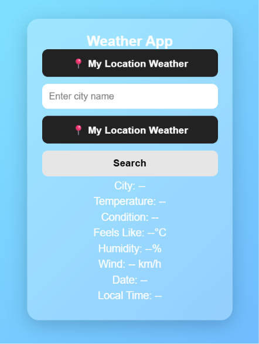

# Weather App 🌦️

# 🌦 Advanced Weather App

A modern Weather Application built using HTML, CSS, and JavaScript with OpenWeather API.  
It provides real-time weather data by city name and also supports user location-based weather.


---

## 📸 Screenshot


---


---

## 🚀 Live Demo

[View Weather App](https://abhi12012.github.io/weather-app/)


## 🚀 Features

- 🌍 Search weather by city name
- 📍 Get weather using current location
- 🌡 Real-time temperature display
- ☁ Weather condition with icons
- 💧 Humidity information
- 🌬 Wind speed (km/h)
- 🌡 Feels like temperature
- 🕒 Local city date & time
- ⏳ Loader animation during API fetch
- ❌ Error handling (invalid city / location denied)
- 📱 Responsive and clean UI

---

## 🆕 Major Upgrades

Compared to basic weather app:

### ❌ Old Version:
- Only city weather search
- Basic UI
- No error handling
- No location support
- No loading state

### ✔ New Version:
- City + Location based weather
- Loader system added
- Better error handling
- Time & Date feature added
- Weather icons added
- Improved UI/UX
- Better user experience

---

## ⚙ Tech Stack

- HTML5
- CSS3
- JavaScript (ES6)
- OpenWeather API

---

## 🔑 API Key Setup

This project uses OpenWeather API.

👉 Get your API key from:
https://openweathermap.org/api

Then replace in code:

```js
const apiKey = "YOUR_API_KEY_HERE";